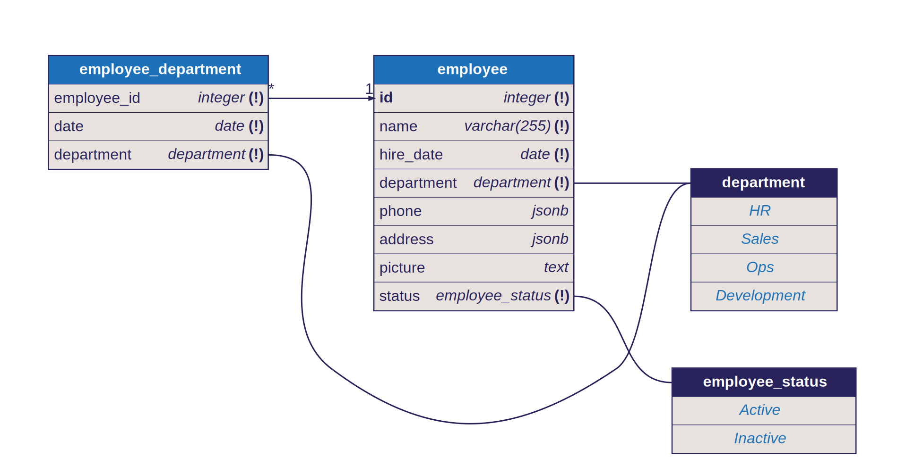

This is a [Next.js](https://nextjs.org) project bootstrapped with [`create-next-app`](https://nextjs.org/docs/app/api-reference/cli/create-next-app).

# Employee Management

This is a showcase project for a Software Engineer hiring process. The idea is to build an Employee Management app, demonstrating your skills and delivery quality as a Developer.

## Getting Started

**Install dependencies**

```bash
pnpm install # or npm, yarn, etc
```

**Setup environment**

For this project, we're using a PostGres and a Blob storage instance, both under Vercel.

An example file under `.example.env` shows the needed variables.

**Start the application**

To start the local server, run:

```bash
pnpm dev
```

Open [http://localhost:3000](http://localhost:3000) with your browser to see the result.

## Tooling

On this project we're using:

- [Next.js](https://nextjs.org/docs) - the production ready framework for React.
- [Drizzle ORM](https://orm.drizzle.team/docs) - a headless TypeScript ORM with a head, with PostGres.
- [Tailwind CSS](https://tailwindcss.com/docs) - Rapidly build modern websites without ever leaving your HTML.
- [ShadCN/UI](https://ui.shadcn.com/) - Beautifully designed components that you can copy and paste into your apps.

## Architecture

### Data



> Notice: We opted for a simpler modeling on the Department entity (just an ENUM), since this application had no use cases requiring a proper table model.

### Application

```bash
.
├── app
│   ├── api           # REST API routes
│   └── employee      # Pages and components
│
├── components        # UI components
│   ├── employee
│   ├── interaction
│   ├── layout
│   └── ui
│
├── contexts          # Data sharing contexts
│   ├── department
│   └── employee
│
├── hooks             # Utility hooks
│
├── lib               # Data access and modeling
│   ├── actions
│   ├── db
│   ├── openapi
│   └── ...
│
└── ...

```

### Highlights

- Using Parallel Routes / Interception to load modals and other partial elements via routes
- Data access handled through Server Actions
- Integrated typing / schema generation
- Realtime updates with cache revalidation
- Context for easy data sharing between components - still fed by Server Actions data
- React Hook Forms leveraging the rich data scheming
- OpenAPI docs for REST API

And whatnot.

### Considerations

On the spirit of a timed evaluation, a few enhancements on componentization, file naming, styling and others were deprioritized.

Enjoy! Cheers,
